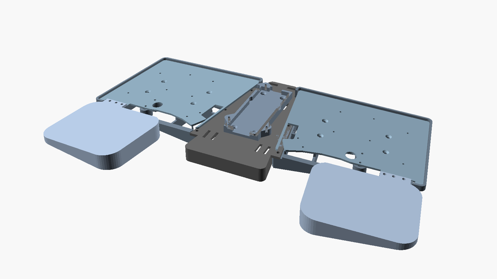
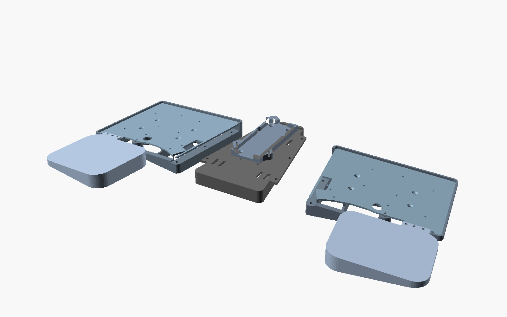

# laptop-keyball61-case

Keyball61（左右トラックボール搭載）を膝の上で安定して使うためのラップボード。
220×220×250mm の 3D プリンタで印刷できるよう3分割（＋Touch ID ポッド）の固定式設計。


## 特徴

- **固定式のシンプル構成**: 可動機構なし。ハの字 10°・テンティング 7° を印刷形状で作り込む
  （`splay` / `tent_angle` / `kb_corner_x` を変えて再印刷すれば配置を変更可能）
- **パームレスト間は開放**: 前方中央は material レスの V 字空間。パームレストは外側基準の幅108mmで
  親指側(内側前方)を大きくカットし印刷を安定化（ブレース座面用の支持アームのみ内側エッジに残す）
- **サイド2枚 + 中央ブリッジ1枚**を市販の M3 ネジで連結（下面ツライチ、継手は段差はめ込み）
- **中央に Touch ID ポッド**: 摘出済み Magic Keyboard モジュール用ドック。バッテリー有無で2バージョン
- **ベッド直接印刷の 2mm マウントプレート**がアクリル底板の置き換え: キーボードは机上で
  プレートに**純正の M2 ネジとボールケースネジで固定**し、プレートごとサイドのポケットへ
  落として M3×8 皿 ×4/側 で固定する（楔内部の座ぐり奥に薄肉を作る方式は印刷精度が出ないため）。
  組立は「プレート→サイド固定」が先で、キーボードはΦ8貫通穴経由で下から純正ネジ止め。7°斜面に載るプレートの穴位置は
  cos(tent) 投影でサイド側と整合させてある。
  トラックボール部・ボール PCB がプレートからはみ出すため、前方の縁はボール周辺から内側にかけて取付面からさらに 4mm 掘り下げて逃げ済み

## パーツ構成（印刷物・すべて PLA / サポート不要）

| ファイル | サイズ (mm) | 数 | 備考 |
|---|---|---|---|
| `stl/side_left.stl` | 180×212×25 | 1 | 取付面+パームレスト+7°楔+連続継手タブ(凸)。印刷向きに回転済み |
| `stl/side_right.stl` | 180×212×25 | 1 | 左のミラー |
| `stl/bridge.stl` | 142×162×8 | 1 | 台形。下面に連続継手ポケット(凹・リブ入り)・ポッド取付穴付き |
| `stl/plate_left.stl` | 143×114×2 | 1 | マウントプレート(アクリル底板相当)。ベッド直接印刷で精度確保 |
| `stl/plate_right.stl` | 143×114×2 | 1 | 左のミラー |
| `stl/brace.stl` | 155×130×3.5 | 1 | 左右サイドを上側で連結するH形プレート(閉断面化)。TRSジャック/プラグ部は切り欠きで回避 |
| `stl/touchid_pod.stl` | 64×94×8 + 蓋 | 各1 | バッテリー無し版 |
| `stl/touchid_pod_battery.stl` | 64×132×11 + 蓋 | 各1 | バッテリー(123×30×3)を基板の下に縦積み |

## 購入部品（BOM）

**キーボード固定（任意の M2）以外のネジは M3×8 皿小ねじ 1 種類に統一。**
旧・可動式設計の M4 ノブボルト / M4 四角ナット / M4 ワッシャは不要。

| 用途 | 品名 | 数量 | 備考 |
|---|---|---|---|
| 共通ネジ | **M3×8 皿小ねじ** | **24 (+予備)** | 継手 6（ナット締結）/ プレート固定 8・ブレース 6・ポッド固定 2・蓋 2（セルフタップ） |
| ナット | M3 六角ナット（対辺 5.5・1種または2種） | 6 | 継手用（サイド側ポケットに挿入） |
| KB固定 | （購入不要）純正 M2 ネジ / ボールケースネジを流用 | - | ネジ穴下の肉厚をアクリルと同じ 2.0mm にしてあるため |
| 滑り止め | 底面用滑り止めシート | 適量 | サイド・ブリッジ裏（膝側） |
| パームレスト | ジェルパッド（手持ち流用） | 2 | パームレスト面に貼付 |

## Touch ID ポッド

実測値反映済み: 基板 85×31×3 / ボタン 16×16×3（蓋の角穴から露出）/ ポート 19×3.1（南面開口）。
バッテリー(123×30×3)の**有り/無し 2 バージョン**を `make` で両方生成。


- 蓋ネジボスは壁一体のガセット付き（対角2箇所、M3×8 皿セルフタップ）
- ベイ北壁のスリット(幅15mm)からボタン延長ケーブル等を北へ引き出せる
- **ブリッジの取付穴は両バージョン共通**（バッテリー版はフランジ穴をオフセット）なので、
  ポッドだけ差し替えられる
- あとで調整する値: `tid_btn_x / tid_btn_y`（蓋の角穴位置）、`tid_port_off`（ポート左右位置）。
  基板をベイに置いて実測してから蓋を印刷するとよい
- ボタンが沈む場合は `tid_pedestal_h`、モジュール固定は薄手の両面テープ推奨

## ビルド

```sh
make            # 全STL生成（要: brew install openscad）
make images     # プレビュー画像
# プレート外形の再抽出（通常不要。要 ezdxf）
python3 scripts/extract_outline.py path/to/Keyball61_Rev1_BallSide_Bottom_Acryl_Clear2mm.dxf
```

外形は [keyball 公式 design_data](https://github.com/Yowkees/keyball/tree/main/keyball61/design_data) の
底板アクリル DXF から実寸化（ポイント単位・0.353407mm/unit。公式 KiCad 基板のスペーサー穴8点との
相似変換フィットで確定。プレート実寸 143.0×113.5mm）。左右ともボール搭載なので BallSide 形状を両側に使用（右はミラー）。

## 印刷設定の目安

- PLA / レイヤー 0.2〜0.28mm / 壁 3 周 / インフィル 12〜15%
- サイドは体重がかかるためインフィルより壁数を増やす方が効く。反りが出る場合はブリム推奨
- **全パーツサポート不要**。サイドの継手タブはベッド直上に印刷されるためブリッジ処理すら不要。
  ブリッジ下面の継手ポケット天井は前後壁で両端支持された 26mm ブリッジで、
  スライサーのブリッジ機能だけで印刷できる。座ぐり・皿ざぐり類の小さな穴天井も自動ブリッジで問題ない

## 組立

1. **先にマウントプレート単体**をサイドのポケットへ落とし、上から M3×8 皿 ×4 で固定
   （セルフタップ。キーボードを載せる前なのでドライバーが上から届く）
2. **キーボードからアクリル底板を外して**プレートの上に載せ、サイド底面のΦ8貫通穴から
   純正 M2 ネジ・ボールケースネジを**下から**締める（磁化ドライバー推奨。
   穴の深さは位置により6〜18mm）。取り外しも同じ経路で可能
3. サイドの継手タブ（凸）にブリッジ下面のポケット（凹）をかぶせ、M3 ナット×3 を
   ブリッジ上面の六角ポケットへ落とし込み、下から M3×8 皿で締結（左右とも）
4. ポッドのトレイをブリッジへ M3×8 皿 ×2 で固定（下穴へのセルフタップ。締めすぎ注意）
5. モジュールを入れ、Touch ID ボタンの延長ケーブルを北壁のスリットから出して
   蓋を M3×8 で閉じる
6. H形ブレースをサイドの座面に載せ、上から M3×8 皿 ×6 で固定（セルフタップ）。
   TRS ケーブル類は切り欠き部で下ろしてギャラリーへ通すか、ブレースの上に這わせる

## v3: モジュラー構造（並行検討中）

固定式v2とは別系統の、**中空モジュール分割＋ネジ結合**の構成。`scad/v3/`。
**左右キーボードの間隔はv2より5cm狭い**（`v3_corner_x = 20`）。




| パーツ | 印刷 | 説明 |
|---|---|---|
| `stl/v3_kb_box_left/right.stl` | 正立 | **KBフレーム**: 段付き周壁(外リム+プレート座リブ)＋**井桁壁**(x=44/113, y=45/74)＋井桁交点のプレート固定ボス4＋BCネジ筒柱2。天板なし＝プレートが天板 |
| `stl/v3_plate_left/right.stl` | 平置き(ベッド直接) | **長方形マウントプレート**(v3専用)。ボール張り出し帯とパーム耳受けの上のみ欠き取り |
| `stl/v3_palm_box_left/right.stl` | **伏せ**(回転済) | パームシェル。差し替え式(形を変えたらこれだけ再印刷) |
| `stl/v3_center_box.stl` | **伏せ**(回転済) | 台形トーションボックス(**四隅角丸**)。ポッド直載せ・ベルクロ/結束バンドスロット・後付け底蓋ボス付き |
| `stl/v3_center_lid.stl` | 平置き | 後付け底蓋(任意)。M3×8皿×4で面一固定、閉断面化 |
| `stl/v3_pod.stl` | 平置き | Touch IDポッド(v3専用・フランジレス)。トレイ+蓋を並べて印刷 |

設計ルール（実機知見）:

- **内部構造は全キーボード穴(M2/BC/ボール)から7mm以上離す**——キーボード下面の
  ネジ頭・スペーサーの逃げ。初回印刷で干渉して組めなかった対策。`make check` で検証
- ボール部品がプレート外形からはみ出す**南帯(kb x≥46)には楔面-8.6より上に構造を
  置かない**（v2の逃げと同じ）。プレートの欠き取り・パーム耳の配置(x≤45.5)もこの帯を回避
- 全パーツ**サポート・ブリッジ実質不要**

ジョイント（すべて**ボルト+ナットの垂直締結**、上から普通のドライバーで作業）:

- 各接続は**長い耳1枚に穴3つ**（個別の耳3枚だと印刷誤差で嵌合が渋くなるため集約）
- 受け側=KBフレームの壁切り欠き＋ボス帯＋横挿しナットスロット。差し側=中央箱の
  デッキ面一耳(y114..228) / パーム天板面一耳(x15..45.5)
- ジョイント12本は**M3×8なべ**(薄い耳に皿もみすると縁が刃状になるため)。
  プレート・ポッド・底蓋はM3×8皿(セルフタップ)
- バッテリーはポッドではなく**中央箱の内部に結束バンドで固定**
  （間隔短縮で箱が細くなりバッテリー版ポッドが収まらないため）

**組立順**（すべて上からのネジ作業。下からはキーボードの純正ネジのみ）:
1. KBフレームのナットスロット6箇所（東壁3=内側から西向き・南壁3=内側から北向き）に
   M3ナットを横挿し
2. パームの耳をKB南壁の切り欠きに載せ、上からM3×8なべ×3（頭はジェルパッドの下）
3. 中央箱の耳をKB東壁の切り欠きに載せ、上からM3×8なべ×3/側
4. マウントプレート→フレーム: 上からM3×8皿×4/側（井桁交点のボスへ）
5. キーボード→プレート: 下から純正M2×7 → ボールケースを上から挿入し下からBCネジ×2
6. ポッド: トレイをベイ床からM3×8皿×4でデッキへ → モジュール/ケーブル → 蓋M3×3。
   バッテリーは箱内部に結束バンド固定。底蓋は任意でM3×8皿×4

**検証**: `make check`（要 `pip install trimesh numpy`）が
単一ボディ/1層目接地/ネジ軸素通し/ナット位置/干渉/7mmルール を自動チェックする。

## v4: 平面構造（前作方式・検討中）

極力2mm厚の平面で構成する前作ラップボード方式。`scad/v4/`。3パーツ+ネジ6本のみ。

| パーツ | 印刷 | 説明 |
|---|---|---|
| `stl/v4_plate_left/right.stl` | ベタ置き | **一体平面プレート**(2mm): キーボード搭載部+パームレスト+中央張り出し。フェンスなし。**たわみ抑えリブ**(3×5mm)×2本: ジェルパッド80×95mm領域の北縁に沿う水平1本+外側エッジ沿いの縦1本(西端で合流するL字)。パッドのストッパー兼用 |
| `stl/v4_center_spine.stl` | ベタ置き | **切妻テント形の中実スパイン**: 上面=左右7°の切妻(テント角を作る)、底面=フラットで浮く。厚さ5.4〜11mm。底面は下面カバーの蓋を兼ねる |
| `stl/v4_center_cover.stl` | ベタ置き | **下面カバー**(任意): スパイン下の空間(深さ約10mm)を覆う。底2mm+スカート壁。ケーブル/モジュール収納 |

- 全パーツ**組立の向きのままベタ置き印刷・サポートゼロ**
  （当初の中空箱案は立て印刷が細長すぎて不安定だったため中実スパインに単純化）
- プレート内縁がスパインに12mm重なり、**上からの縦M3×8なべ→スパイン底面の
  六角ポケットのナット** ×3/側で締結（ボルト+ナット。ポケットが回り止め、
  ナット上の肉3mmでM3×8全ネジ掛かり。ポケット天井は**45°六角テーパー**で
  ブリッジ垂れを防止——ナットは六角外周のリムで座る）
- キーボードは従来同様、プレートに下から純正ネジで固定（プレート=アクリル代替）
- ボール張り出し帯の貫通欠き取りは**実物確認で不要と判明し埋めた**
  （組立時にボール周辺部品が当たる場合は `-D v4_ball_relief=true` で復活）
- スパイン/カバーは**プレートが覆う範囲(y114〜238)に収め、前後に飛び出さない**
- **下面カバー**: スパイン底面が蓋になり、下の空間(深さ約10mm)にケーブルや
  Touch IDモジュール等を収納(内部長約118mm。バッテリー123mmは直置き不可)。
  下からM3×8なべ×4→**スパイン上面(露出帯)の六角井戸に上から落としたナット**で
  締結。井戸が回り止め・重力でナットが座ったままなので工具は下のドライバーだけ。
  **これでv4のM3は全箇所ボルト+ナット(セルフタップなし)**。
  北縁にUSB・東西縁にTRSのケーブルノッチ
- 北縁沿いに**ケーブルまとめ用の3×15スロット×2**(外側後方の角+親指キー付近の2つのM2穴の真北)
- TRRSジャックの真東(外形東縁とスパインの間)に**TRSケーブル通し穴**10×18。
  プラグごと表から裏へ通し、カバーのTRSノッチへ導く
- スプレイ10°・左右間隔はv3と同じ短縮値(`v4_corner_x=20`)
- 注意: 平面構造なのでプレートは接地ライン(外側エッジ)以外浮く。膝上での使用前提
- ネジ: M3×8なべ×10 + M3ナット×10 + 純正キーボードネジ(セルフタップなし)
- **検証**: `make check-v4`（単一ボディ/平面性/軸素通し/ナット位置/印刷オーバーハング/干渉）

## 設計メモ

- 座標系: 組立座標はボード中心 x=0、手前が y 小。サイドは kb ローカル座標で作って
  `splay` 回転で配置（`scad/side.scad`）。継ぎ目は `seam_x(y)` が定義する斜め直線
- `scad/assembly.scad` の `demo_explode` で分解図を確認できる
- 旧・可動キャリッジ版（Tスロット+M4ノブで無段階調整）は `archive/adjustable-v1/` に保存
