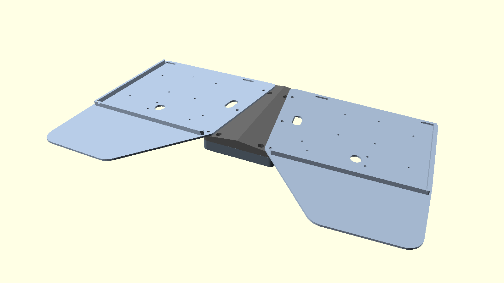
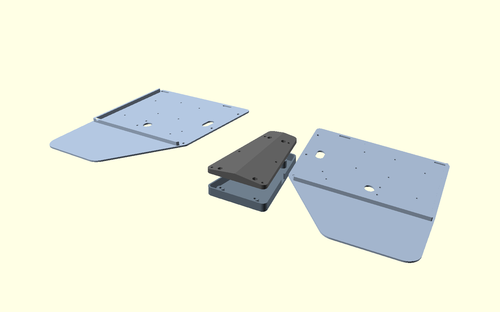

# Keyball61 ラップボード

[Keyball61](https://shirogane-lab.net/)（左右ともトラックボール搭載）を膝上で使うための
3Dプリント製ラップボード。極力2mm厚の平面で構成し、キーボードは付属の
アクリル底板の代わりにプレートへ純正ネジで直接固定する。




## 構成 (4パーツ + M3×8なべ×6 + M3×8皿×4 + M3ナット×10)

| パーツ | 印刷 | 説明 |
|---|---|---|
| `stl/v4_plate_left/right.stl` | ベタ置き | **一体平面プレート**(2mm): キーボード搭載部+パームレスト+中央張り出し。たわみ抑えのL字リブ(3×5mm)付き |
| `stl/v4_center_spine.stl` | ベタ置き | **切妻テント形の中実スパイン**: 上面=左右7°の切妻(テント角を作る)、底面=フラットで浮く。厚さ5.4〜11mm。底面は下面カバーの蓋を兼ねる |
| `stl/v4_center_cover.stl` | ベタ置き | **下面カバー**(任意): スパイン下の空間(深さ約10mm)を覆う。底2mm+スカート壁、外周はスパインと面一。底面の接地エッジと座ぐり口元は45°面取り(足に当たるため) |

- スプレイ10°・テンティング7°(スパインの形状が作る)・左右間隔は `v4_corner_x = 20`
- 全パーツ**組立の向きのままベタ置き印刷・サポートゼロ**
- **全ネジがボルト+ナット**(セルフタップなし):
  - ジョイント: プレート内縁がスパインに12mm重なり、上からM3×8なべ×3/側→
    スパイン底面の六角ポケットのナット(回り止め・天井は45°テーパーで印刷品質確保)
  - カバー: 下からM3×8皿×4(座ぐり奥の90°皿座=45°テーパーで印刷品質確保)→
    スパイン上面(露出帯)の六角井戸に落としたナット
- キーボードは従来のアクリルと同様、プレートに下から純正ネジで固定
- たわみ抑えリブ: ジェルパッド80×95mm領域(パーム外側の隅)の北縁+外側エッジの
  L字。パッドの位置決めストッパー兼用
- ケーブル関連: 北縁沿いにまとめ用3×15スロット×2(外側後方の角+親指キー付近の
  M2穴の真北)、TRRSジャック真東にTRSケーブル通し穴10×18(プラグごと裏へ通し
  カバーのTRSノッチへ)、カバー北縁にUSBノッチ
- 注意: 平面構造なのでプレートは接地ライン(外側エッジ)以外浮く。膝上での使用前提

## 組立

1. スパイン底面の六角ポケット×6にM3ナットを差し込む
2. プレートをスパインの屋根フランジに重ね、上からM3×8なべ×3/側で締結
3. キーボードをプレートに載せ、下から純正ネジで固定(アクリル底板と同じ要領)。
   ボールケースも従来通り
4. (任意) スパイン上面の六角井戸×4にナットを落とし、カバーを下からM3×8皿×4で固定。
   ケーブル・Touch IDモジュール等はカバー内へ(バッテリー123mmは直置き不可)
5. ジェルパッドをリブに突き当てて貼る

## ビルド

```sh
make            # STL生成 (要 OpenSCAD: brew install --cask openscad)
make check      # 設計検証 (要 pip install trimesh numpy)
make images     # ドキュメント画像の再生成
```

パラメータは `scad/params.scad`(共通)と `scad/v4/v4_params.scad`。
キーボード外形は公式アクリルDXFから `scripts/extract_outline.py` で生成した実寸
(`scad/keyball61_outline.scad`, ポイント単位 0.353407mm/unit)。

`make check`(`scripts/verify_v4.py`)は 単一ボディ/平面性/ネジ軸の素通し/
ナット位置の空洞/印刷オーバーハング/部品間干渉 を自動チェックする。
設計変更のたびに必ず実行すること。

## 履歴

- v1(可動キャリッジ式)・v2(固定式の楔+ブリッジ+ブレース)・v3(中空モジュール5分割)は
  git履歴を参照。v4は前作ラップボードの平面構造方式を採用したもの
