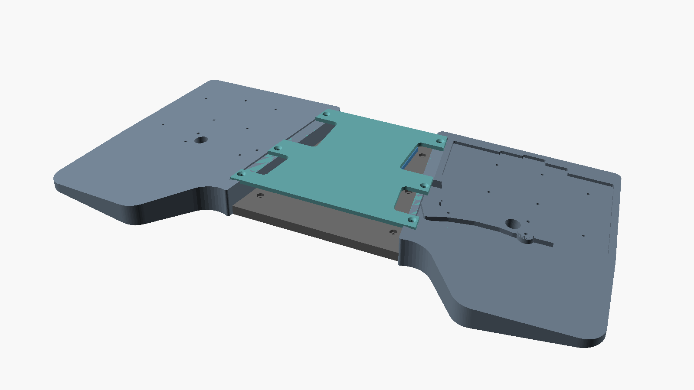
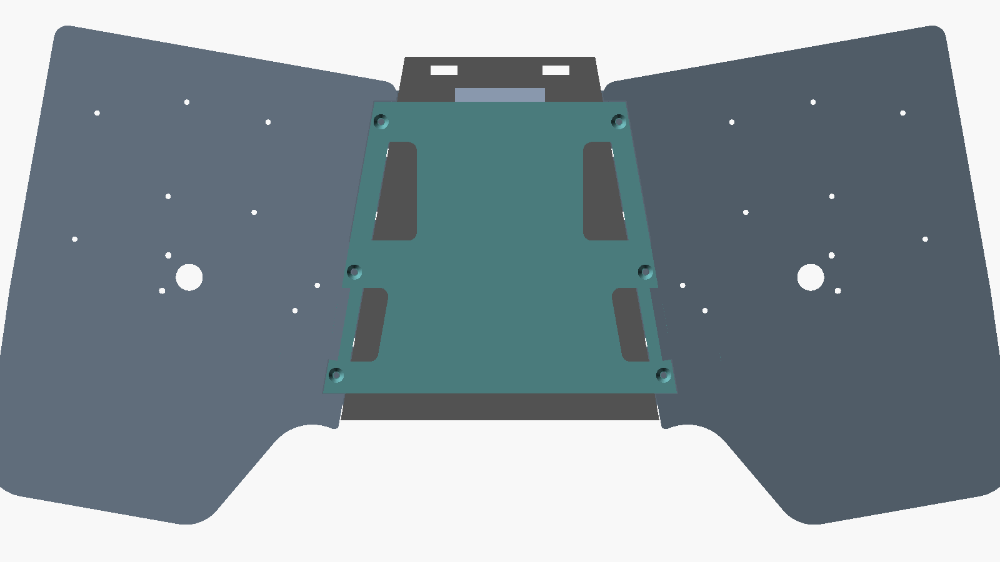
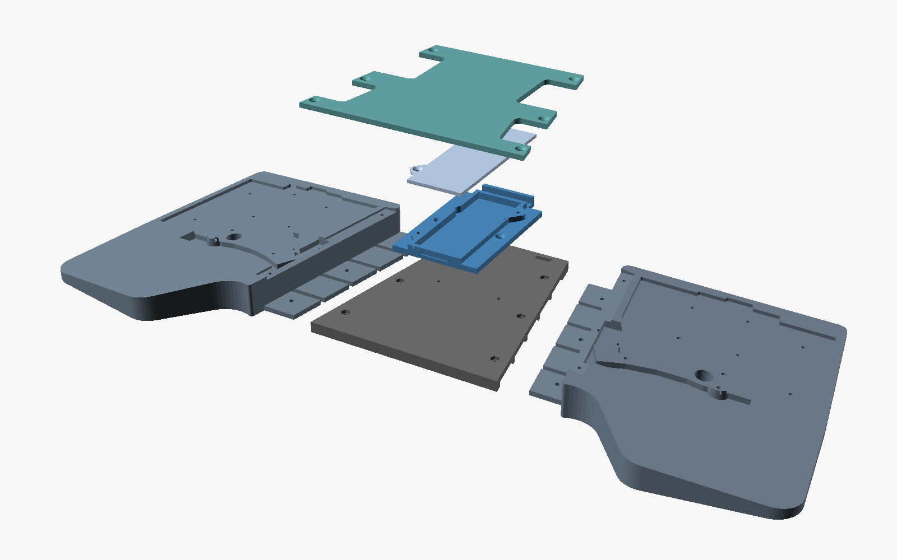
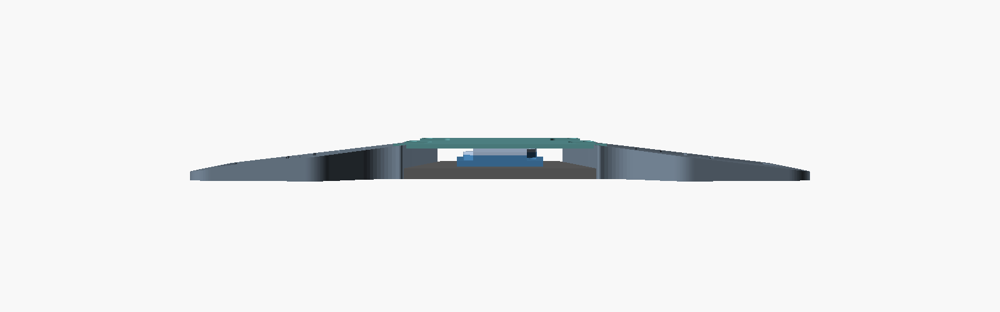
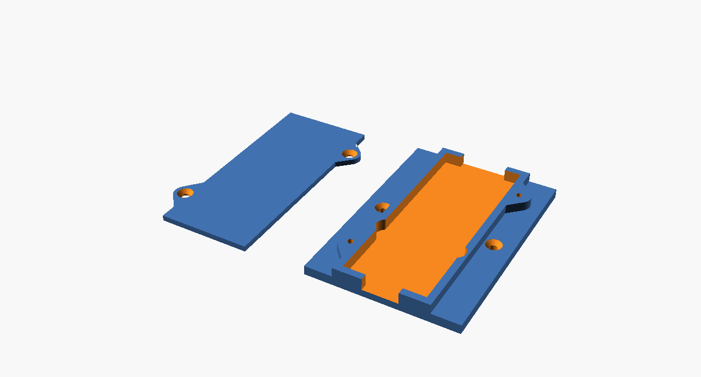
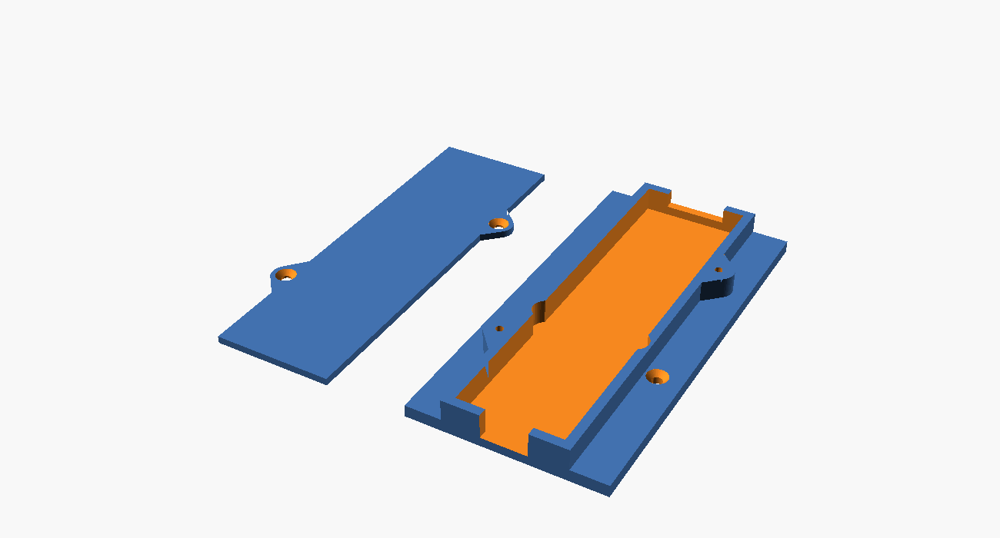

# laptop-keyball61-case

Keyball61（左右トラックボール搭載）を膝の上で安定して使うためのラップボード。
220×220×250mm の 3D プリンタで印刷できるよう3分割（＋Touch ID ポッド）の固定式設計。






## 特徴

- **固定式のシンプル構成**: 可動機構なし。ハの字 10°・テンティング 7° を印刷形状で作り込む
  （`splay` / `tent_angle` / `kb_corner_x` を変えて再印刷すれば配置を変更可能）
- **パームレスト間は開放**: 前方中央は material レスの V 字空間。パームレストは外側基準の幅108mmで
  親指側(内側前方)を大きくカットし印刷を安定化（ブレース座面用の支持アームのみ内側エッジに残す）
- **サイド2枚 + 中央ブリッジ1枚**を市販の M3 ネジで連結（下面ツライチ、継手は段差はめ込み）
- **中央に Touch ID ポッド**: 摘出済み Magic Keyboard モジュール用ドック。バッテリー有無で2バージョン
- **TRS ケーブルギャラリー**: ポッド北側に蓋付きの配線溝（東西貫通）。左右キーボードをつなぐ
  TRS ケーブルの中央部と余長をポッド内に隠せる
- **ケースはアクリル底板（Bottom Acryl）の置き換え**: 取付面の彫り込みは実寸 DXF から起こした
  アクリル外形そのもの。ネジ穴下の肉厚を 2.0mm（＝アクリル板厚）にしてあるので、
  **純正の M2 ネジとボールケースネジをそのまま使って**下から直接固定できる。
  トラックボール部・ボール PCB がプレートからはみ出すため、前方の縁はボール周辺から内側にかけて取付面からさらに 4mm 掘り下げて逃げ済み

## パーツ構成（印刷物・すべて PLA / サポート不要）

| ファイル | サイズ (mm) | 数 | 備考 |
|---|---|---|---|
| `stl/side_left.stl` | 180×212×25 | 1 | 取付面+パームレスト+7°楔+連続継手タブ(凸)。印刷向きに回転済み |
| `stl/side_right.stl` | 180×212×25 | 1 | 左のミラー |
| `stl/bridge.stl` | 142×162×8 | 1 | 台形。下面に連続継手ポケット(凹・リブ入り)・ポッド取付穴付き |
| `stl/brace.stl` | 155×130×3.5 | 1 | 左右サイドを上側で連結するH形プレート(閉断面化)。TRSジャック/プラグ部は切り欠きで回避 |
| `stl/touchid_pod.stl` | 64×105×8 + 蓋 | 各1 | バッテリー無し版 |
| `stl/touchid_pod_battery.stl` | 64×143×11 + 蓋 | 各1 | バッテリー(123×30×3)を基板の下に縦積み |

## 購入部品（BOM）

**キーボード固定（任意の M2）以外のネジは M3×8 皿小ねじ 1 種類に統一。**
旧・可動式設計の M4 ノブボルト / M4 四角ナット / M4 ワッシャは不要。

| 用途 | 品名 | 数量 | 備考 |
|---|---|---|---|
| 共通ネジ | **M3×8 皿小ねじ** | **16 (+予備)** | 継手 6（下面から・ナット締結）/ ブレース 6・ポッド固定 2・蓋 2（セルフタップ） |
| 継手用 | M3 六角ナット（対辺 5.5・1種または2種） | 6 | サイド側ポケットに挿入 |
| KB固定 | （購入不要）純正 M2 ネジ / ボールケースネジを流用 | - | ネジ穴下の肉厚をアクリルと同じ 2.0mm にしてあるため |
| 滑り止め | 底面用滑り止めシート | 適量 | サイド・ブリッジ裏（膝側） |
| パームレスト | ジェルパッド（手持ち流用） | 2 | パームレスト面に貼付 |

## Touch ID ポッド

実測値反映済み: 基板 85×31×3 / ボタン 16×16×3（蓋の角穴から露出）/ ポート 19×3.1（南面開口）。
バッテリー(123×30×3)の**有り/無し 2 バージョン**を `make` で両方生成。




- 蓋ネジボスは壁一体のガセット付き（対角2箇所、M3×8 皿セルフタップ）
- 北側の**ケーブルギャラリー**に TRS ケーブルを通す。蓋がそのままカバーになる
- **ブリッジの取付穴は両バージョン共通**（バッテリー版はフランジ穴をオフセット）なので、
  ポッドだけ差し替えられる
- あとで調整する値: `tid_btn_x / tid_btn_y`（蓋の角穴位置）、`tid_port_off`（ポート左右位置）。
  基板をベイに置いて実測してから蓋を印刷するとよい
- ボタンが沈む場合は `tid_pedestal_h`、モジュール固定は薄手の両面テープ推奨

## ビルド

```sh
make            # 全STL生成（要: brew install openscad）
make images     # プレビュー画像
# プレート外形の再抽出（通常不要。要 ezdxf）
python3 scripts/extract_outline.py path/to/Keyball61_Rev1_BallSide_Bottom_Acryl_Clear2mm.dxf
```

外形は [keyball 公式 design_data](https://github.com/Yowkees/keyball/tree/main/keyball61/design_data) の
底板アクリル DXF から実寸化（ポイント単位・0.353407mm/unit。公式 KiCad 基板のスペーサー穴8点との
相似変換フィットで確定。プレート実寸 143.0×113.5mm）。左右ともボール搭載なので BallSide 形状を両側に使用（右はミラー）。

## 印刷設定の目安

- PLA / レイヤー 0.2〜0.28mm / 壁 3 周 / インフィル 12〜15%
- サイドは体重がかかるためインフィルより壁数を増やす方が効く。反りが出る場合はブリム推奨
- **全パーツサポート不要**。サイドの継手タブはベッド直上に印刷されるためブリッジ処理すら不要。
  ブリッジ下面の継手ポケット天井は前後壁で両端支持された 26mm ブリッジで、
  スライサーのブリッジ機能だけで印刷できる。座ぐり・皿ざぐり類の小さな穴天井も自動ブリッジで問題ない

## 組立

1. **キーボードからアクリル底板を外し**、スペーサーを取付面の彫り込みに合わせて置き、
   下から純正 M2 ネジで固定（左右とも）。ボールケースも純正ネジで下から固定
2. サイドの継手タブ（凸）にブリッジ下面のポケット（凹）をかぶせ、M3 ナット×3 を
   ブリッジ上面の六角ポケットへ落とし込み、下から M3×8 皿で締結（左右とも）
3. ポッドのトレイをブリッジへ M3×8 皿 ×2 で固定（下穴へのセルフタップ。締めすぎ注意）
4. モジュールを入れ、TRS ケーブルと Touch ID ボタンの延長ケーブルをギャラリーに
   通してから蓋を M3×8 で閉じる
5. H形ブレースをサイドの座面に載せ、上から M3×8 皿 ×6 で固定（セルフタップ）。
   TRS ケーブル類は切り欠き部で下ろしてギャラリーへ通すか、ブレースの上に這わせる

## 設計メモ

- 座標系: 組立座標はボード中心 x=0、手前が y 小。サイドは kb ローカル座標で作って
  `splay` 回転で配置（`scad/side.scad`）。継ぎ目は `seam_x(y)` が定義する斜め直線
- `scad/assembly.scad` の `demo_explode` で分解図を確認できる
- 旧・可動キャリッジ版（Tスロット+M4ノブで無段階調整）は `archive/adjustable-v1/` に保存
